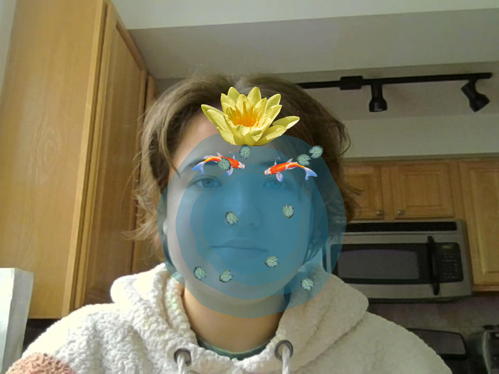

# Mask
This mask represents some pieces of my identity using symbolism in a pond. 

### Symbols
* __Pond__: I grew up near a large pond. Even the street I live on had 'pond' in the name. I have always enjoyed the outdoors and the pond near my home was my inspiration for this project.
* __Face under water__: As a child and almost all the way through high school, I was very quiet.  Trying to hear someone underwater is difficult, if not impossible, and puting a face under water in this mask represents that quietness.
* __Koi__: The koi fish on the eyebrows are there because I have always been told I have bold eyebrows, and the bright orange of the fish draw your eyes to the eyebrows.
* __Flower__: The flower at the top of the head is to represent creativity with my hair. My hair has gone through many changes through the years. I used to have very long hair, then I cut it shoulder length. After that, I died it multiple times, almost wearing every color of the rainbow. Later on, I completely shaved my head. I always enjoyed being creative and expressive of my hair. The flower represents this because flowers are known for being colorful and the way flowers bloom remind me of the current phase of my hair: growing it out after shaving it off.